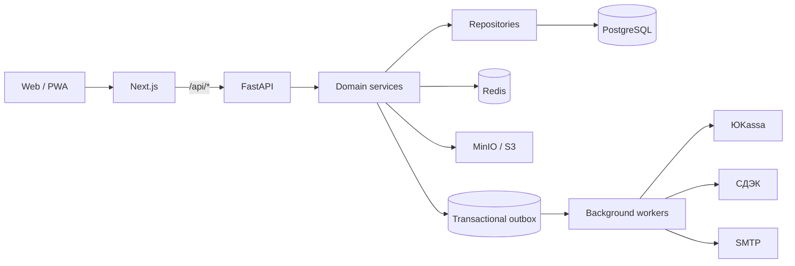

<div align="center">
  

  # GARMENT BURO

  **Веб-платформа кастомной одежды: магазин, конструктор изделий и внутренняя CRM.**

  [](https://fastapi.tiangolo.com/)
  [](https://nextjs.org/)
  [](https://www.postgresql.org/)
  [](https://min.io/)
  [](https://github.com/Garment-Buro/garment-buro/actions/workflows/ci.yml)
  [](https://github.com/Garment-Buro/garment-buro)
</div>

---

## О проекте

Garment Buro объединяет клиентскую веб/PWA-часть, backend API и внутренние инструменты производства в одном монорепозитории.

- витрина, карточки товаров и адаптивный интерфейс;
- конструктор и персонализация изделий;
- корзина, заказы и резервирование остатков;
- авторизация, профиль клиента и кабинеты сотрудников;
- платежи через ЮKassa и доставка через СДЭК;
- email-уведомления через надёжную очередь;
- хранение медиа и закрытых CRM-файлов в S3-совместимом хранилище;
- производственная CRM: материалы, модели, техкарты и движение заказов.

> [!IMPORTANT]
> Кодовая база подготовлена для безопасного перехода от legacy MVP к новой архитектуре. Новые модули закрыты feature flags и включаются только после миграции данных и проверки на development/staging. Production не переключается на новые пути до rehearsal и проверки внешних интеграций.

## Технологии

| Область | Стек |
| --- | --- |
| Frontend | Next.js 16, React 19, TypeScript, Zustand, Tailwind CSS, PWA |
| Backend | FastAPI, Python 3.12, Pydantic, SQLAlchemy 2.0 async |
| Данные | PostgreSQL 17, Alembic, Redis |
| Файлы | MinIO / S3-compatible storage |
| Интеграции | ЮKassa, СДЭК, SMTP |
| Инфраструктура | Docker Compose, GHCR, GitHub Actions, Nginx, health checks, workers |

## Архитектура



Backend строится по одному направлению зависимостей:

```text
router -> service -> repository -> SQLAlchemy model
                   -> integration client
```

HTTP-слой не содержит бизнес-логику, PostgreSQL остаётся источником постоянных данных, Redis используется только для кэша и координации, а внешние побочные действия выполняются через сохраняемую очередь.

## Быстрый запуск

Понадобятся Docker с Compose и Git.

```bash
git clone git@github.com:Garment-Buro/garment-buro.git
cd garment-buro
cp .env.example .env
```

Создайте уникальный `JWT_SECRET` длиной не менее 32 символов и добавьте его в `.env`:

```bash
openssl rand -hex 32
```

Затем поднимите локальный стек:

```bash
docker compose -f docker-compose.local.yml up --build
```

| Сервис | Адрес |
| --- | --- |
| Приложение | http://localhost:3000 |
| Backend API | http://localhost:8000 |
| Liveness | http://localhost:8000/health/live |
| Readiness | http://localhost:8000/health/ready |
| MinIO API | http://localhost:9000 |
| MinIO Console | http://localhost:9001 |

Остановка проекта:

```bash
docker compose -f docker-compose.local.yml down
```

Данные PostgreSQL, Redis и MinIO хранятся в Docker volumes и не удаляются обычной командой `down`.

## Разработка без Docker

### Backend

```bash
python3.12 -m venv .venv
.venv/bin/pip install -r backend/requirements-dev.txt

cd backend
../.venv/bin/python -m uvicorn app.main:app --reload
```

### Frontend

```bash
cd frontend
npm ci
INTERNAL_API_URL=http://localhost:8000 npm run dev
```

В браузере API всегда вызывается через same-origin пути `/api/*` и `/uploads/*`. Адрес backend используется только на серверной стороне Next.js и не должен попадать в клиентский код.

## Проверки перед коммитом

```bash
cd backend
make PYTHON=../.venv/bin/python check

cd ../frontend
npm ci
npm run check
npm audit
```

Проверка backend включает Ruff, pytest и генерацию SQL для полного upgrade/downgrade Alembic. Проверка frontend включает ESLint, тесты и production-сборку Next.js.

## Структура репозитория

```text
garment-buro/
├── backend/
│   ├── app/                  # FastAPI, доменные модули и integrations
│   ├── migrations/           # Alembic migrations
│   ├── scripts/              # workers, migration и reconciliation tools
│   ├── tests/                # unit, contract и integration tests
│   └── docs/refactoring/     # отчёты по завершённым этапам
├── frontend/
│   ├── app/                  # Next.js routes
│   ├── components/           # UI по предметным областям
│   ├── hooks/                # клиентские controllers
│   ├── lib/                  # API, domain logic и конфигурация
│   └── public/               # PWA и статические ресурсы
├── deploy/                   # server Compose, Nginx, backup и deploy scripts
├── .github/workflows/        # CI и GHCR deployment pipelines
├── docker-compose.local.yml  # локальная среда
├── docker-compose.yml        # legacy production compatibility
├── .env.example              # полный перечень конфигурации
└── nginx*.conf               # reverse proxy и TLS bootstrap
```

## Feature flags и безопасное включение

Новые пути миграции по умолчанию выключены. Основные переключатели находятся в `.env.example`:

- `CATALOG_READS_ENABLED` и `CATALOG_WRITES_ENABLED`;
- `IDENTITY_API_ENABLED` и `NEXT_PUBLIC_IDENTITY_SESSION_V2_ENABLED`;
- `CARTS_V2_ENABLED`, `ORDER_READS_ENABLED`, `CHECKOUT_V2_ENABLED`;
- `PAYMENT_CREATION_ENABLED`, `PAYMENT_WEBHOOK_V2_ENABLED`,
  `PAYMENT_MANAGEMENT_ENABLED`, `YOOKASSA_PAYOUTS_ENABLED`;
- `CRM_API_ENABLED`, `CRM_WRITES_ENABLED`, `CRM_FILES_ENABLED`;
- `FULFILLMENT_*_ENABLED` и `CDEK_*_ENABLED`.

Не включайте связанные флаги по отдельности. Порядок миграции, fingerprints и staging rehearsal описаны в [плане рефакторинга](backend/REFACTORING_PLAN.md) и [backend README](backend/README.md).

## Правила работы

1. Создавайте отдельную ветку от актуального `main`.
2. Не коммитьте `.env`, ключи, токены, выгрузки БД, uploads и локальные volumes.
3. Сохраняйте направление `router -> service -> repository -> model`.
4. Любое изменение схемы оформляйте Alembic-миграцией с проверяемым downgrade.
5. Для платежей, доставки и уведомлений сохраняйте idempotency и outbox semantics.
6. Перед merge запускайте backend и frontend quality gates.

```bash
git switch main
git pull --ff-only
git switch -c features/short-description
```

## Ветки и окружения

| Ветка | Окружение | Адрес |
| --- | --- | --- |
| `main` | production | https://garment-buro.ru |
| `develop` | development | https://dev.garment-buro.ru |
| `features/*` | только CI | без автоматического deploy |

После успешных тестов GitHub Actions собирает отдельные backend/frontend образы,
публикует их в GHCR и передаёт серверу только ссылки на образы и deployment
descriptors. Исходный код на сервере не собирается. Перед переключением контейнеров
обязательно выполняются Alembic migrations и readiness-проверки.
Docker Engine для приложения работает в rootless-режиме от отдельного пользователя
`garment`; системный rootful-демон не используется после завершения переноса.

Полная инструкция: [deploy/README.md](deploy/README.md).

## Документация

- [Backend: запуск, миграции и интеграции](backend/README.md)
- [План рефакторинга backend](backend/REFACTORING_PLAN.md)
- [Схема внутренних CRM-данных](CRM_DATA_SCHEMA.md)
- [Frontend: запуск и устройство](frontend/README.md)
- [Production/development deployment](deploy/README.md)
- [Отчёты по этапам рефакторинга](backend/docs/refactoring/)

---

<div align="center">
  <strong>GARMENT BURO</strong><br />
  Когда вещь почти подходит — можно её доработать.
</div>
